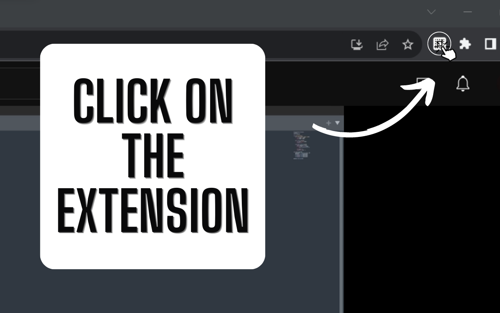
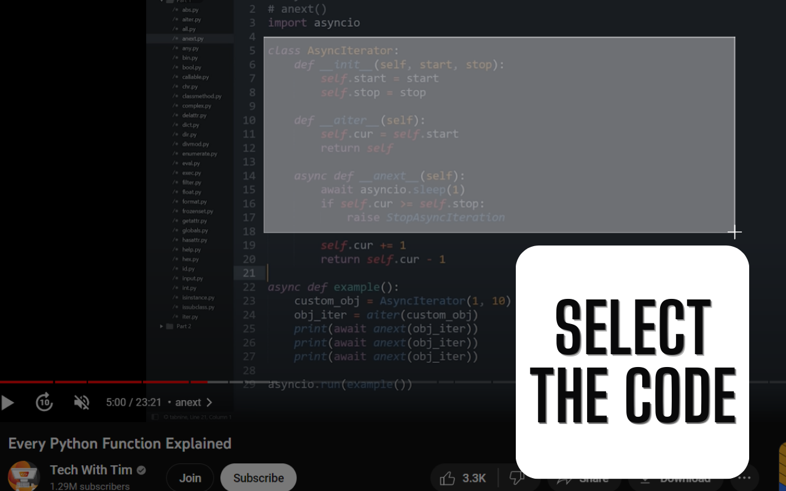
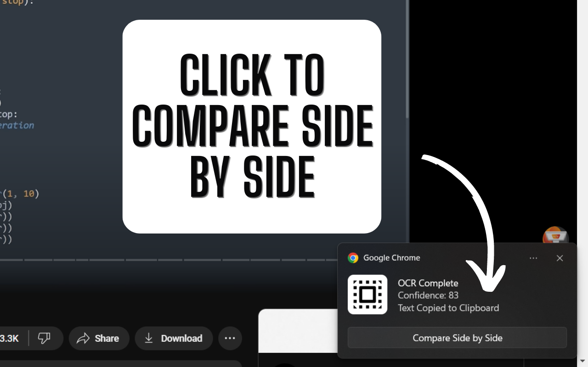
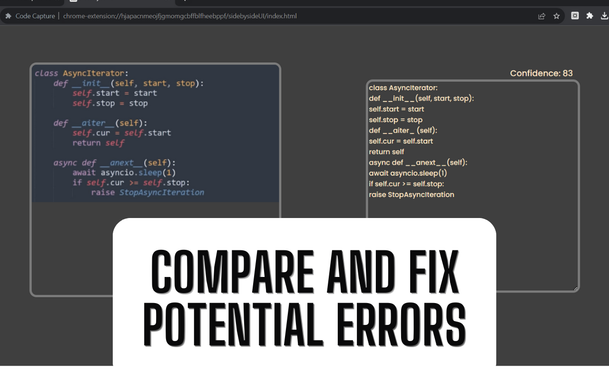

# Code Capture Chrome Extension (MV3)

Now you can easily extract code from videos without constantly switching tabs!

## How to use

- Click the extension icon.
- Select the region of the code or click the extension icon again to cancel selection.
- Wait for the processing to take place.
- Once processed, the code will be copied to your clipboard. You can also compare the code and the image side by side to identify any potential errors.

## Important
- The technology used to extract code from videos is called Tesseract, which may not always produce 100% accurate results.
- The accuracy will depend on the type of image captured. For better results, ensure that the video is played at the highest quality before selecting the region.
- All processing is performed locally, ensuring the privacy of your data.
## Credits

Links to some of the features used by this extension:

- [Jcrop](https://github.com/tapmodo/Jcrop)
- [Tesseract.js](https://github.com/naptha/tesseract.js)
- [Neuicons (for the display icon)](https://www.svgrepo.com/svg/487767/select-all)

## Installation

### Locally:

1- Download the ZIP and extract its contents

2 - Open Chrome and navigate to chrome://extensions/

3 - Enable Developer Mode

4 - Click on "Load Unpacked" and select the extracted folder to install the extension

### Chrome Store:

[Chrome Web Store](https://chrome.google.com/webstore/detail/code-capture/ibkjgebmefpibfipgfaphonpdljaekni)
